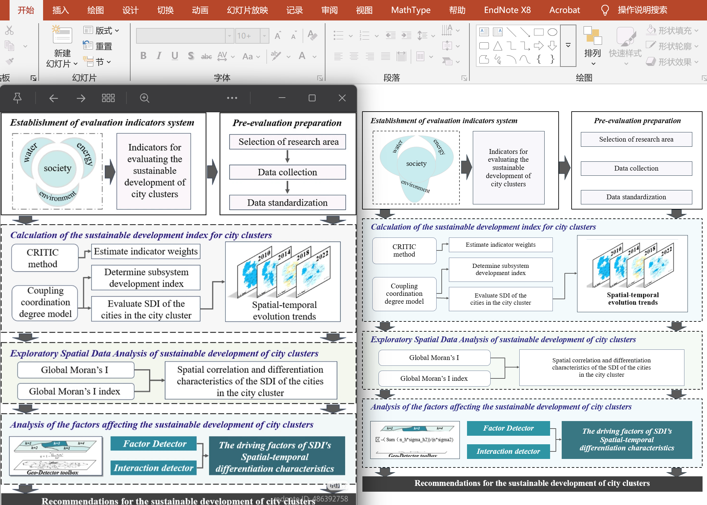
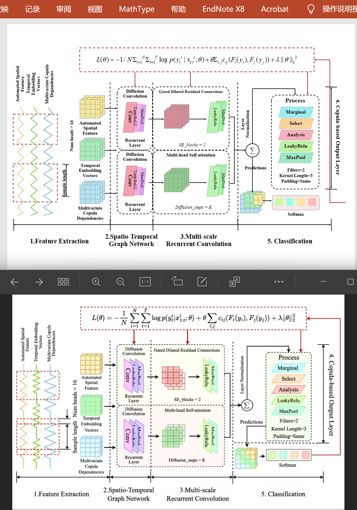
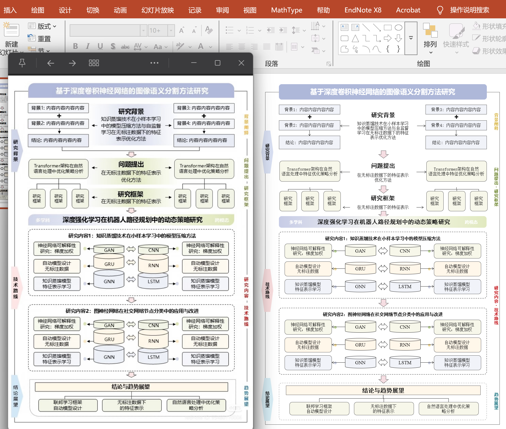
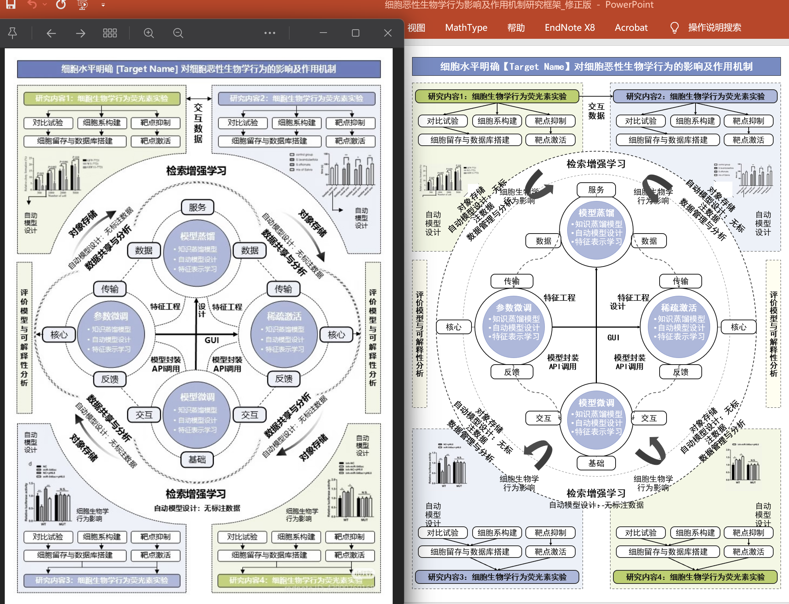

# PPT Framework Skill

[English](README_EN.md) | 中文

面向 Codex 的可编辑学术框图 PowerPoint 技能。它可以将参考图片忠实复刻为可编辑 PPT，也可以根据论文、Word、提纲或结构说明，从零设计技术路线图、研究框架图、系统框图和章节概览图。

本项目关注的不是“生成一张看起来相似的图片”，而是交付可以在 PowerPoint 中继续修改的原生对象：文本框、形状、连接器、箭头、图片以及可编辑的 Office 原生公式或真实 MathType 公式。

## 核心能力

- **参考图忠实复刻**：保持源图的模块、文字、形状、曲线、箭头、配色、层级和连接拓扑，不近似重构、不擅自简化。
- **根据内容从零设计**：读取论文、Word、提纲或文字说明，先生成低保真 SVG 骨架供用户确认，再制作正式 PPT。
- **原生可编辑对象**：不使用整页截图冒充可编辑成果；文本、节点、逻辑箭头和公式均可独立编辑。
- **严格箭头几何**：保持箭头类型、头部数量、方向、锚点和路径；折线箭头必须是单个 PowerPoint 原生对象，禁止分段拼接。
- **文字排版约束**：正文保持完整段落；禁止无意义硬换行、横排单字行、孤立英文 token 和文字碰撞。
- **双公式模式**：统一调用最新 `formula-skill`，支持 PowerPoint 原生专业公式和真正的 MathType `Equation.DSMT4`，不得互相冒充。
- **公式启动确认**：含公式任务必须先确认公式类型、目标 PPTX 完整路径和一页/多页排版，再开始识别与写入。
- **快速单页工作流**：普通单页正式制作以约 10 分钟为目标，采用一次构建、一次局部修复、一次最终检查。

## 演示

### 1. 高密度技术路线图忠实复刻

保持原图结构、配色、文本层级和局部图像，同时将主要框图元素重绘为 PowerPoint 可编辑对象。



### 2. 含 MathType 公式的神经网络框图

复刻多尺度时空神经网络结构，保留严格的水平/垂直连接、模块边界和真实 MathType 公式。



### 3. 根据研究内容重新设计框架图

根据研究背景、问题、框架、技术路线和研究内容重新组织版式，并保持模块层级清楚、文本不碰撞。



### 4. 复杂循环与多分区研究框架复刻

处理环形机制、曲线箭头、四象限实验区、侧边竖排标签以及高密度中心模块。



## 两种工作模式

### 模式 A：参考图忠实复刻

适用于：

- “根据此图画 PPT 版”
- “把论文中的框图重绘成可编辑 PPT”
- “保持原比例、字体和箭头连接关系”

执行流程：

1. 汇总页面尺寸、方向、比例、字体字号；含公式时同时确认公式类型、目标 PPTX 完整路径和分页形式。
2. 等待用户最终确认全部参数。
3. 逐项记录源图中的对象、文本、箭头、锚点、层级和几何。
4. 一次生成权威 PPTX。
5. 调用最新 `formula-skill` 批量插入已确认类型的可编辑公式（如需要）。
6. 从最终保存的 PPTX 渲染并检查，修复阻断问题后交付。

参考图本身就是结构、配色和内容依据，因此不会重复询问模板、配色或内容来源。

### 模式 B：根据论文、提纲或文字从零制作

适用于：

- 技术路线图
- 研究框架图
- 系统框图
- 章节安排图
- 论文方法概览图

执行流程包含两道确认闸门：

1. **参数确认**：确认模板/结构、配色、内容依据、处理方式、页面、字体和公式方案。
2. **SVG 骨架确认**：先提交一张“PPT 骨架预览（非最终 PPT）”，供用户审核模块、区域、流程、反馈和公式位置。
3. 用户确认完整骨架后，才正式打开 PowerPoint 并制作可编辑 PPTX。

## 最高优先级规则

1. 文字的实际可见字形不得与框线、箭头、形状、图片、公式或其他文字碰撞。
2. 每条折线或折线箭头必须是一个 PowerPoint 原生可编辑对象，禁止拼接。
3. 除源图明确要求外，横排文本不得出现单字行、孤立 token、孤立标点或项目符号独占一行。
4. 参考图任务不得删减、合并、改写或新增源图中的模块、文字、形状、曲线和箭头。
5. 原图水平或垂直的连接必须保持严格水平或垂直，连接锚点不得自行改变。
6. 已知 PPTX 路径时必须按绝对路径直接启动；禁止通过截图寻找“打开”窗口并输入路径。
7. 所有公式识别与写入必须委托给最新 `formula-skill`；Office 模式必须为原生公式，MathType 模式必须为 `Equation.DSMT4`。

完整规则见 [SKILL.md](SKILL.md)。

## 安装

### 方式一：克隆到 Codex skills 目录

```powershell
git clone https://github.com/huashu996/PPT-Framework-Skill.git `
  "$HOME\.codex\skills\Paper-framework-skill"
```

重新打开 Codex 后，使用：

```text
$paper-fig-skill
```

### 方式二：作为已有技能更新

```powershell
git -C "$HOME\.codex\skills\Paper-framework-skill" pull
```

## 使用示例

### 忠实复刻参考图

```text
$paper-fig-skill 根据这张图生成可编辑 PPT。
A4 纵向，保持原比例，宋体 10–14 pt，图中无公式。
```

### 含公式的学术框图

```text
$paper-fig-skill 复刻此图为 PPT。
A4 横向，Times New Roman 10–16 pt，公式使用 MathType；
保存到 C:\output\framework-mathtype.pptx，全部放在一页。
```

### 根据论文内容从零设计

```text
$paper-fig-skill 根据 Word 第三章制作系统框架图。
使用提供的参考图作为结构风格，A4 纵向，蓝绿色配色，
提取重要公式并使用 Office 原生公式；保存到 C:\output\framework-office.pptx，全部放在一页。
```

技能会先汇总全部制作参数。对从零设计任务，还会先提交 SVG 骨架，只有用户确认后才生成正式 PPT。

## 环境要求

- Codex，且能够加载本项目的 `SKILL.md`
- Windows 桌面版 Microsoft PowerPoint
- Python 3 与 `pywin32`（`python -m pip install -r requirements.txt`）
- 需要公式时：已安装最新 `formula-skill`
- 仅 MathType 模式需要本机安装并注册 `Equation.DSMT4`；Office 原生模式不需要 MathType
- 用于生成 PPT 的 Codex 演示文稿运行时与 `@oai/artifact-tool`
- 参考图复刻时：清晰的 PNG/JPG 图片

MathType 不是所有任务的必需依赖；只有用户明确选择 MathType 时才启用。公式识别与写入规则以同级安装的 `formula-skill/SKILL.md` 为准。

## 项目结构

```text
PPT-Framework-Skill/
├── SKILL.md
├── README.md
├── README_EN.md
├── requirements.txt
├── agents/
│   └── openai.yaml
└── docs/
│   └── images/
│       ├── demo-faithful-redraw.png
│       ├── demo-mathtype-architecture.png
│       ├── demo-from-outline.png
│       └── demo-complex-cycle-redraw.png
```

公式功能不再在本仓库重复实现，统一依赖独立的最新 `formula-skill`。

## 设计原则

- 提速来自参数化布局、组件复用和减少返工，而不是降低忠实度。
- 用户确认优先于自动生成器默认值。
- 源图可见几何优先于语义猜测和自动连接。
- PowerPoint 最终保存状态优先于生成器预览、窗口缩略图或对象数量。
- 未通过最终检查时，不声称“已审核”或“可交付”。

## 说明

本技能专门用于单页或少量页面的高密度学术框图，不是通用长篇演示文稿生成器。复杂源图的实验图片、显微图和照片可以作为独立图片嵌入；逻辑框图部分仍应保持可编辑。
